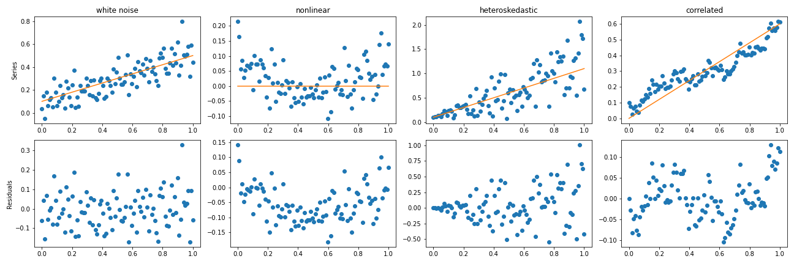
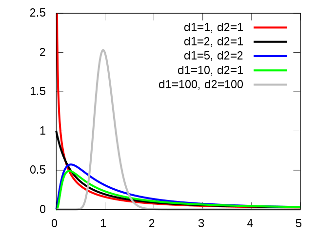

# Linear Regression

<style>
.container{
    display: flex;
}
.col{
    flex: 1;
}
</style>

---

## Descriptive Statistics

----

### A Simple Dataset

- Duncan's Occupational Prestige Data

- Many *occupations* in 1950.
- $x$: education
  - Percentage of occupational incumbents in 1950 who were high school graduates
- $y$: income
  - Percentage of occupational incumbents in the 1950 US Census who earned $3,500 or more per year
- $z$: Percentage of respondents in a social survey who rated the occupation as “good” or better in prestige 
----

### Quick look

<div class="container">

<div class="col">

```python
import statsmodels.api as sm
dataset = sm.datasets.get_rdataset("Duncan", "carData")
df = dataset.data
df.head()
```

|            | type | income | education | prestige |
| ---------- | ---- | ------ | --------- | -------- |
| accountant | prof | 62     | 86        | 82       |
| pilot      | prof | 72     | 76        | 83       |
| architect  | prof | 75     | 92        | 90       |
| author     | prof | 55     | 90        | 76       |
| chemist    | prof | 64     | 86        | 90       |

</div>

<div class="col">

```
plt.plot(df['education'],df['income'],'o')
plt.grid()
plt.xlabel("Education")
plt.ylabel("Income")
plt.savefig("data_description.png")
```


</div>

</div>

----

### Descriptive Statistics


<div class="container">

<div class="col">

- For any variable $v$ with $N$ observations:
  - mean: $\overline{v} = \frac{1}{N} \sum_{i=1}^N v_i$
  - variance $V({v}) = \frac{1}{N} \sum_{i=1}^N \left(v_i - \overline{v} \right)^2$
  - standard deviation : $\sigma(v)=\sqrt{V(v)}$

</div>

<div>

```
df.describe()
```

|       | income    | education  | prestige  |
| ----- | --------- | ---------- | --------- |
| count | 45.000000 | 45.000000  | 45.000000 |
| mean  | 41.866667 | 52.555556  | 47.688889 |
| std   | 24.435072 | 29.760831  | 31.510332 |
| min   | 7.000000  | 7.000000   | 3.000000  |
| 25 %  | 21.000000 | 26.000000  | 16.000000 |
| 50 %  | 42.000000 | 45.000000  | 41.000000 |
| 75 %  | 64.000000 | 84.000000  | 81.000000 |
| max   | 81.000000 | 100.000000 | 97.000000 |

</div>

----

###  Relation between variables

- How do we measure relations between two variables (with $N$ observations)
  - Covariance: $Cov(x,y) = \frac{1}{N}\sum_i (x_i-\overline{x})(y_i-\overline{y})$
  - Correlation: $Cor(x,y) = \frac{Cov(x,y)}{\sigma(x)\sigma(y)}$

- By construction, $Cor(x,y)\in[-1,1]$
  - if $Cor(x,y)>0$, x and y are __positively correlated__
  - if $Cor(x,y)<0$, x and y are __negatively correlated__

- Interpretation: 
  - <!-- .element class="fragment" --> no interpretation!
  - correlation is not causality
  - also: data can be correlated by pure chance (spurious [correlation](https://www.tylervigen.com/spurious-correlations))

----

### Examples

<div class="container">

<div class="col">


```python
df.cov()
```

|           | income     | education  | prestige   |
| --------- | ---------- | ---------- | ---------- |
| income    | 597.072727 | 526.871212 | 645.071212 |
| education | 526.871212 | 885.707071 | 798.904040 |
| prestige  | 645.071212 | 798.904040 | 992.901010 |

</div>

<div class="col">

<div class="fragment">

```python
df.corr()
```

|           | income   | education | prestige |
| --------- | -------- | --------- | -------- |
| income    | 1.000000 | 0.724512  | 0.837801 |
| education | 0.724512 | 1.000000  | 0.851916 |
| prestige  | 0.837801 | 0.851916  | 1.000000 |

</div>

</div>
</div>


---

## Fitting the data

----

### A Linear Model


<div class="container">

<div class="col">

- Consider the line:
$$y = α + β x$$

- <!-- .element class="fragment" data-fragment-order=2 --> Several possibilities. 
- <!-- .element class="fragment" data-fragment-order=3 --> Which one do we choose to represent the model?

- <!-- .element class="fragment" data-fragment-order=4 -->Need some criterium.

</div>

<div class="col">

<div class="r-stack">

 


</div>

</div>

</div>


----

### Least Square Criterium


<div class="container">

<div class="col">

- <!-- .element class="fragment" data-fragment-order="1" --> Compare the model to the data:
$$y_i = \alpha + \beta x_i + \underbrace{e_i}_{\text{prediction error}}$$
-<!-- .element class="fragment" data-fragment-order="2" --> Square Errors
$${e_i}^2 = (y_i-\alpha-\beta x_i)^2$$
- <!-- .element class="fragment" data-fragment-order="3" -->Loss Function: sum of squares
$$L(\alpha,\beta) = \sum_{i=1}^N (e_i)^2$$
</div>


<div class="r-stack">

 


</div>


</div>

----

### Minimizing Least Squares


<div class="container">

<div class="col">

- Try to chose $\alpha, \beta$ so as to minimize the sum of the squares $L(α, β)$

- It is a convex minimization problem: unique solution

- This direct iterative procedure is used in machine learning

</div>


<div class="r-stack">

 


</div>


</div>


----

### Ordinary Least Squares (1)

- The mathematical problem $\min_{\alpha,\beta} L(\alpha,\beta)$ has one unique solution
  - proof not important here

- Solution is given by the explicit formula:
$$\hat{\alpha} = \overline{y} - \hat{\beta} \overline{x}$$
$$\hat{\beta} = \frac{Cov({x,y})}{Var(y)} = Cor(x,y) \frac{\sigma(y)}{\sigma({x})}$$

- $\hat{\alpha}$ and $\hat{\beta}$ are *estimators*.
  - Hence the hats.
  - More on that later.

----

### Concrete Example

- In our example:
$$\underbrace{y}\_{\text{income}} = 10 + 0.59 \underbrace{x}\_{education}$$

- We can say that income and education are positively *correlated*
- We can say that  a unit increase in education is associated with a 0.59 increase in income
- We can say that  a unit increase in education *explains* a 0.59 increase in income
- But:
  - here *explains* does __not__ mean *cause*

---

## Variance Decomposition

----

### Predictions

- It is possible to make *predictions* with the model:
  - How much would an occupation which hires 60% high schoolers fare salary-wise?


- Prediction: salary measure is $45.4$
- OK, but that seems noisy, how much do I really predict ? Can I get a sense of the precision of my prediction ?

----

### Look at the residuals

<div class="container">


<div class="col">

- Plot the residuals: 


</div>

<div class="col">

- Any abnormal observation?
- Theory requires residuals to be:
  - zero-mean
  - non-correlated
  - normally distributed
- That looks like a normal distribution
    - standard deviation is $\sigma(e_i) = 16.84$
- A more honnest prediction would be $45.6 ± 16.84$

</div>


</div>


----

### What could go wrong



- a well specified model, residuals must look like *white noise* (i.i.d.: independent and identically distributed)
- when residuals are clearly abnormal, the model must be changed

---

### Variance decomposition

- What is the share of the total variance explained by the variance of my prediction?

    $$R^2 = \frac{Var(\alpha + \beta x_i)}{Var(y_i)} = Cor(x,y)$$

- Coefficient of determination is a measure of the explanatory power of a regression
  - but not of the *significance* of a coefficient
  - we'll get back to it when we see multivariate regressions

- In one-dimensional case, it is possible to have small R2, yet a very precise regression coefficient.

---


<!-- 
## Statistical Model

- Can we estimate the variance of the data ?
- Can we estimate a *statistical model*:

$$y_i = α + β x_i + \epsilon_i$$
$$\epsilon_i  \sim \mathcal{N}\left({0,σ^{2}}\right)$$

- We want estimates for: $\hat{α}, \hat{β}, \hat{σ}$
- Turns out the OLS estimator is BLUE:
$$\hat{α} = \overline{y} - \hat{β} \overline{x}$$
$$\hat{β} = r_{x,y} \frac{s(y)}{s{x}}$$
$$\hat{\sigma} = r_{x,y} \frac{s(y)}{s{x}}$$ -->


## Statistical inference

----

### Statistical model


<div class="container">

<div class="col">


- <!-- .element class="fragment" data-fragment-index="1" --> Imagine the true model is:
$$y = α + β x + \epsilon$$
$$\epsilon\_i  \sim \mathcal{N}\left({0,\sigma^{2}}\right)$$
    - errors are independent ...
    - and normallly distributed ...
    - with constant variance (homoscedastic)
- <!-- .element class="fragment" data-fragment-index="2" -->Using this data-generation process, I draw randomly $N$ data points
- <!-- .element class="fragment" data-fragment-index="3" -->Then I compute my estimate $\hat{α}$, $\hat{β}$

- <!-- .element class="fragment" data-fragment-index="4" --> How confident am I in these estimates ?
  - I could have gotten a completely different one...
  - clearly, the bigger $N$, the more confident I am...


</div>

<div class="col">

<div class="r-stack">


</div>

</div>

----

### Statistical inference (simplified)


<div class="container">

<div class="col">

- <!-- .element class="fragment" data-fragment-index="1" --> Assume we have computed $\hat{\alpha}$, $\hat{\beta}$ from the data. Let's make a thought experiment instead.
- <!-- .element class="fragment" data-fragment-index="2" --> Imagine the actual data generating process was given by $\hat{α} + \hat{\beta} x + \epsilon$ where $\epsilon \sim \mathcal{N}(0,Var({e_i}))$
- <!-- .element class="fragment" data-fragment-index="3" --> If I draw randomly $N$ points using this D.G.P. I get new estimates.
- <!-- .element class="fragment" data-fragment-index="12" -->And if I make randomly many draws, I get a <strong>distribution</strong> for my estimate.
    - were my initial estimates very likely ?
    - or could they have taken any value with another draw from the data ?
    - in the example, we see that estimates around of 0.7 or 0.9, would be compatible with the data
- <!-- .element class="fragment" data-fragment-index="13" -->How do we formalize these ideas?
  - Statistical tests.

</div>

<div class="col">

<div class="r-stack">
    
    
    
    
    
    
    
    
    
    
    
<div>

</div>


<div>

----

### Main take away

- Given the true model, all estimators are random variables

- Given the values $\alpha$, $\beta$, $\sigma$ of the true model, we can model the distribution of the estimates.
    - $mean(\hat{\beta}) = (\hat{\beta}) $ (__unbiased__)
    - $\sigma(\hat{\beta}) =  \frac{\sigma^2}{Var(x_i)}$

- Goal construct statistics whose distribution is known, to validate/invalidate a model

---- 


### Fisher-Statistic


<div class="container">

<div class="col">

- Test
  - Hypothesis H0: $α=β=0$ (model explains nothing)
  - Hypothesis H1: (model explains something)
  - Fisher Statistics: $F=\frac{Explained Variance}{Unexplained Variance}$
- <!-- .element class="fragment" --> Distribution of $F$ is known theoretically. 
  - It depends on the number of degrees of Freedom. (Here $N-2=18$)
- <!-- .element class="fragment" --> In our case, $Fstat=40.48$. What was the probability it was that big if $H0$ is true ? 
    - <!-- .element class="fragment" --> extremely small: $Prob(F>Fstat|H0)=5.41e-6$
    - <!-- .element class="fragment" --> we can reject $H0$ with $p-value=5e-6$
- <!-- .element class="fragment" --> In social science, typical p-value is 5%.


</div>

<div class="col">



</div>

</div>

----

### Student test


- So our estimate is $y = \underbrace{0.121}\_{\tilde{\alpha}} + \underbrace{0.794}\_{\tilde{\beta}} x$.
    - we know $\tilde{\beta}$ is a bit random (it's an estimator)
    - are we even sure $\tilde{\beta}$ could not have been zero?

- Student Test:
  - H0: $\beta=0$
  - H1: $\beta \neq 0$
  - Statistics: $t=\frac{\hat{\beta}}{\sigma(\hat{\beta})}$
    - intuitively: compare mean of estimator to its standard deviation
    - also a function of degrees of freedom

- Significance levels (read in a table):
  - for 18 degrees of freedom, $P(|t|>t^{\star})=0.05$  with $t^{\star}=1.734$
  - if $t>t^{\star}$ we are $95%$ confident the coefficient is *significant*


----

### Confidence intervals

- The student test can also be used to construct confidence intervals.

- Given estimate, $\hat{\beta}$ with standard deviation $\sigma(\hat{\beta})$

- Given a probability threshold $\alpha$ (for instance $\alpha=0.05$) we can compute $t^{\star}$ such that $P(|t|>t*)=\alpha$

- We construct the __confidence interval__:

$$I^{\alpha} = [\hat{\beta}-t\sigma(\hat{\beta}), \hat{\beta}+t\sigma(\hat{\beta})]$$

- Interpretation: given the estimated value, one is 95 \% sure ($1-\alpha$) the estimated parameter falls in this interval

---

## Now let's practice
